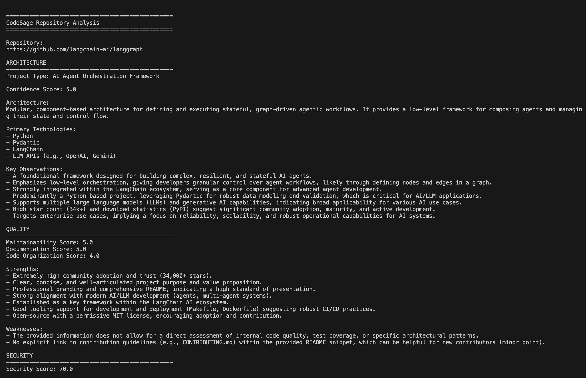
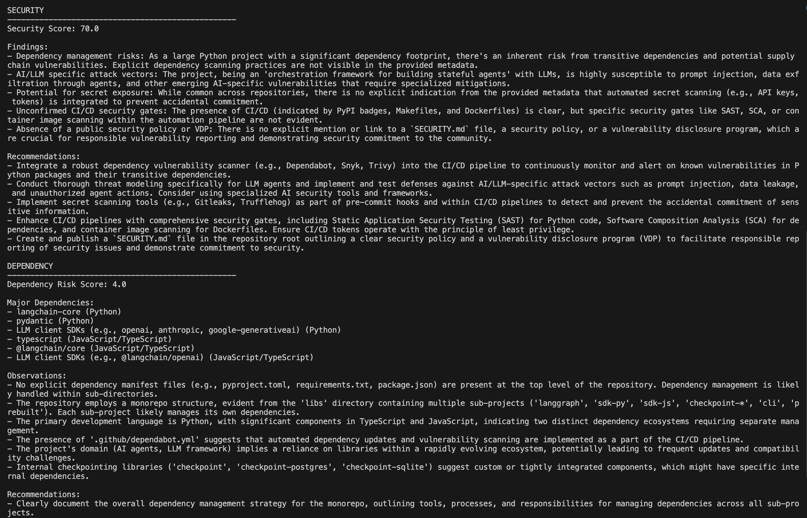
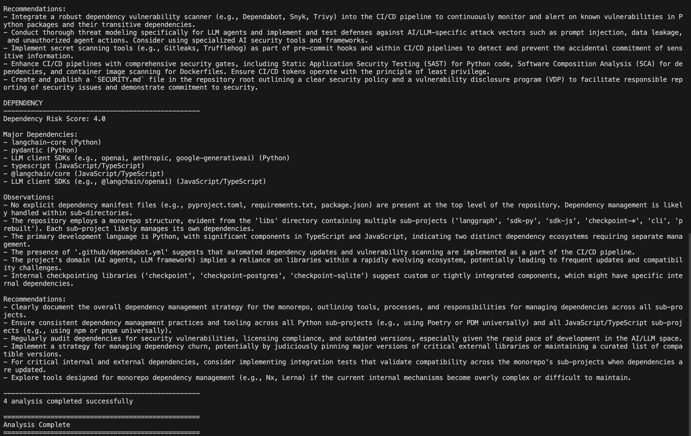

# CodeSage

CodeSage is a LangGraph-powered multi-agent repository intelligence platform that helps developers quickly evaluate unfamiliar GitHub repositories using AI-generated architecture, quality, security, and dependency analysis.

Given a GitHub repository URL, CodeSage collects repository metadata, README content, project structure, dependency information, and language statistics before running specialized AI agents that generate structured repository assessments.

---

## Features

* GitHub repository intelligence
* Repository metadata extraction
* README analysis
* Repository structure analysis
* Dependency file detection
* Architecture analysis agent
* Quality analysis agent
* Security analysis agent
* Dependency analysis agent
* LangGraph workflow orchestration
* Shared repository context
* Structured outputs using Pydantic
* Markdown report generation
* Command-line interface (CLI)

---

## Architecture

```text
GitHub Repository
        │
        ▼
Repository Context Builder
        │
        ▼
      LangGraph
        │
        ▼
 ┌───────────────┐
 │ Architecture  │
 └───────────────┘
        │
 ┌───────────────┐
 │ Quality       │
 └───────────────┘
        │
 ┌───────────────┐
 │ Security      │
 └───────────────┘
        │
 ┌───────────────┐
 │ Dependency    │
 └───────────────┘
        │
        ▼
   Final Analysis
```

---

## Example Use Case

Imagine discovering a new open-source AI framework and wanting a quick technical assessment before spending time reading documentation and source code.

For example:

```bash
python main.py https://github.com/langchain-ai/langgraph
```

Instead of manually reviewing the repository structure, README, technologies, and dependencies, CodeSage generates a consolidated analysis covering:

* Architecture
* Code Quality
* Security
* Dependencies

Example insights:

```text
Architecture:
AI Agent Orchestration Framework

Primary Technologies:
- Python
- Pydantic
- LangChain

Quality:
9/10

Security:
8/10

Dependency Risk:
Low

Key Observations:
- Designed for stateful AI agents
- Strong LangChain integration
- Mature open-source ecosystem
```

This allows developers to quickly evaluate unfamiliar repositories before investing time in a deeper review.

---

## Example Analysis

Below is a complete repository assessment generated by CodeSage for the LangGraph repository.

### Architecture & Quality Analysis



### Security Analysis



### Dependency Analysis & Summary



---

## Project Structure

```text
codesage/
│
├── agents/
│   ├── architecture_agent.py
│   ├── quality_agent.py
│   ├── security_agent.py
│   ├── dependency_agent.py
│   ├── orchestrator.py
│   └── schemas.py
│
├── graphs/
│   ├── __init__.py
│   └── repository_graph.py
│
├── github_utils/
│   ├── client.py
│   ├── parser.py
│   ├── repository.py
│   ├── llm.py
│   └── report_generator.py
│
├── reports/
│
├── scripts/
│
├── main.py
├── requirements.txt
└── README.md
```

---

## Installation

Clone the repository:

```bash
git clone https://github.com/A1SHWARYANAYAK/codesage.git

cd codesage
```

Install dependencies:

```bash
pip install -r requirements.txt
```

---

## Environment Variables

Create a `.env` file in the project root:

```env
GITHUB_TOKEN=your_github_token
GEMINI_API_KEY=your_gemini_api_key
```

---

## Usage

Analyze a GitHub repository:

```bash
python main.py https://github.com/langchain-ai/langgraph
```

---

## Workflow

```text
Repository URL
      │
      ▼
GitHub API
      │
      ▼
Repository Context Builder
      │
      ▼
LangGraph Workflow
      │
      ▼
Architecture Agent
Quality Agent
Security Agent
Dependency Agent
      │
      ▼
Combined Analysis
      │
      ▼
Markdown Report
```

---

## Analysis Agents

### Architecture Agent

Analyzes:

* Project type
* Software architecture
* Primary technologies
* Technical observations

### Quality Agent

Analyzes:

* Maintainability
* Documentation quality
* Code organization
* Strengths
* Weaknesses

### Security Agent

Analyzes:

* Security posture
* Repository hygiene
* Secret exposure risks
* Security recommendations

### Dependency Agent

Analyzes:

* Dependency complexity
* Dependency maturity
* Ecosystem stability
* Maintenance risks
* Dependency recommendations

---

## Example Output

```text
==================================================
CodeSage Repository Analysis
==================================================

Repository:
https://github.com/langchain-ai/langgraph

ARCHITECTURE
--------------------------------------------------
Project Type: AI Agent Framework

QUALITY
--------------------------------------------------
Maintainability Score: 9.0

SECURITY
--------------------------------------------------
Security Score: 8.5

DEPENDENCY
--------------------------------------------------
Dependency Risk Score: 8.0

==================================================
Analysis Complete
==================================================
```

---

## Tech Stack

* Python
* LangGraph
* Gemini API
* PyGithub
* Pydantic
* python-dotenv

---

## Future Improvements

* JSON export
* Parallel LangGraph execution
* License analysis agent
* Dependency vulnerability scanning
* Web dashboard

---

## Why CodeSage?

CodeSage demonstrates several AI engineering concepts:

* Multi-agent system design
* LangGraph workflow orchestration
* Shared-state agent execution
* Structured LLM outputs using Pydantic
* GitHub repository intelligence
* Automated software analysis pipelines

---

## License

MIT